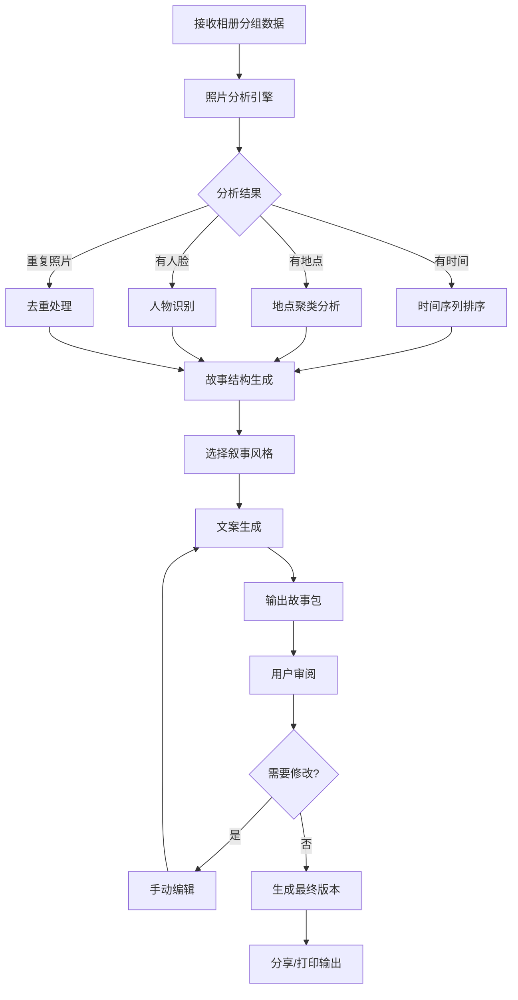
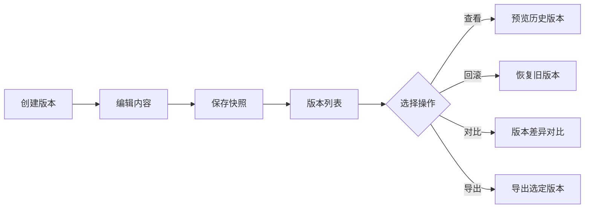
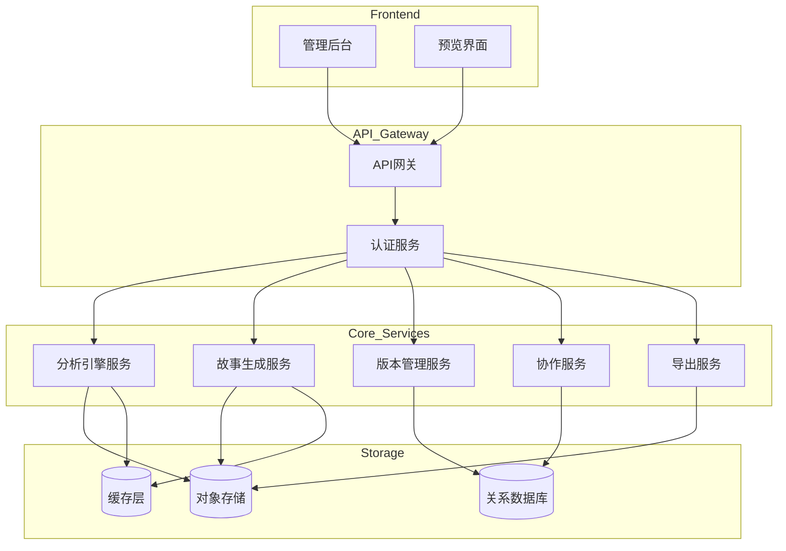

# 小相册故事化后端服务 - 产品需求文档

## 1. 产品概述

将普通照片通过智能分析转化为具有叙事性的可阅读小故事，为相册App、亲子记录工具和打印相册平台提供核心后端服务。

**核心价值**：让冰冷的照片数据变成温暖的生活故事，保留珍贵记忆的情感价值。

**目标用户**：
- 相册App开发者：需要差异化功能，提升用户体验
- 亲子记录工具：为父母提供孩子成长故事的自动化生成
- 打印相册平台：批量生成可阅读性的相册故事脚本

## 2. 核心功能模块

### 2.1 相册分析引擎

#### 2.1.1 时间序列识别
- 自动识别照片EXIF信息中的拍摄时间
- 按时间轴排序，识别日/周/月/年的照片簇
- 检测时间异常照片（如相机时间设置错误）

#### 2.1.2 地点线索分析
- 提取GPS坐标信息
- 地理名称反查（支持中文地名）
- 地点聚类，识别同地点多张照片
- 旅行路线还原

#### 2.1.3 人物主角识别
- 人脸检测与特征提取
- 人物出现频率统计
- 主角识别（出现最多的人物）
- 人物关系推测（通过出现场景）

#### 2.1.4 重复照片检测
- 视觉相似度计算
- 连拍照片识别
- HDR/RAW多版本识别
- 推荐保留最佳照片

### 2.2 故事生成引擎

#### 2.2.1 章节结构生成
- 根据时间/地点自动切分章节
- 智能章节标题生成
- 封面照片建议
- 照片排序优化

#### 2.2.2 场景说明生成
- 基于地点和时间的场景描述
- 节假日/纪念日识别
- 特殊事件推测（如生日、旅行等）

#### 2.2.3 情绪标签系统
- 照片情绪识别（温馨、快乐、感动、宁静等）
- 场景情绪推断
- 整体故事情绪基调

#### 2.2.4 旁白文案生成
- 智能文案撰写
- 多种语气风格支持
- 诗词引用（可选）

#### 2.2.5 明信片短句
- 精美短句推荐
- 地点+情感组合
- 可定制度高

### 2.3 叙事风格管理

#### 2.3.1 风格类型
- **温馨风格**：强调亲情、温暖、感动
- **搞笑风格**：轻松幽默，突出有趣瞬间
- **旅行风格**：以地点为主线，叙事性强
- **成长风格**：记录变化、进步、里程碑
- **纪实风格**：客观记录，时间线清晰
- **艺术风格**：唯美、诗意、有意境

#### 2.3.2 风格参数配置
- 语气强弱度（0-100）
- 文案长度（短/中/长）
- 情感倾向（正面/中性/怀旧）
- 特殊元素（emoji使用量、诗词引用等）

### 2.4 内容编辑管理

#### 2.4.1 手动改稿功能
- 章节标题编辑
- 照片描述修改
- 文案重写
- 批量调整

#### 2.4.2 版本控制系统
- 版本历史记录
- 一键回滚到任意版本
- 版本对比功能
- 自动保存草稿

#### 2.4.3 敏感内容处理
- 人脸模糊处理（可选）
- 敏感信息隐藏
- 内容安全审核接口
- 自定义过滤规则

### 2.5 协作与分享

#### 2.5.1 多人协作编辑
- 协作者权限管理
- 实时冲突处理
- 评论反馈系统
- 任务分配

#### 2.5.2 故事片段收藏
- 精彩片段标记
- 收藏夹管理
- 片段复用

#### 2.5.3 分享包生成
- JSON格式导出
- 包含完整故事结构
- 支持多种格式（图片+文案分离）
- 一键分享链接生成

#### 2.5.4 印刷版摘要输出
- 适合印刷的排版格式
- 印刷说明生成
- 预览效果生成
- 批量处理支持

## 3. 核心业务流程

### 3.1 故事生成主流程

### 3.2 版本管理流程

## 4. API接口设计

### 4.1 相册分析API

#### POST /api/v1/albums/analyze
- **功能**：分析相册照片，提取时间、地点、人物信息
- **输入**：照片URL列表、照片元数据
- **输出**：分析结果JSON（时间线、地点、人物、去重建议）

### 4.2 故事生成API

#### POST /api/v1/stories/generate
- **功能**：生成故事结构
- **输入**：分析结果、叙事风格、参数配置
- **输出**：完整故事结构（章节、标题、文案等）

#### PUT /api/v1/stories/{id}/content
- **功能**：更新故事内容
- **输入**：章节ID、新内容
- **输出**：更新后的故事版本

### 4.3 版本管理API

#### GET /api/v1/stories/{id}/versions
- **功能**：获取版本历史
- **输出**：版本列表（版本号、时间戳、变更摘要）

#### POST /api/v1/stories/{id}/rollback
- **功能**：回滚到指定版本
- **输入**：目标版本ID
- **输出**：回滚结果

### 4.4 协作管理API

#### POST /api/v1/stories/{id}/collaborators
- **功能**：添加协作者
- **输入**：用户ID、权限级别

#### GET /api/v1/stories/{id}/comments
- **功能**：获取评论列表

### 4.5 输出导出API

#### POST /api/v1/stories/{id}/export/share
- **功能**：生成分享包
- **输入**：导出格式、包含内容
- **输出**：分享包URL

#### POST /api/v1/stories/{id}/export/print
- **功能**：生成印刷版
- **输入**：纸张大小、打印份数
- **输出**：印刷版文件

## 5. 数据模型

### 5.1 核心实体

#### Album（相册）
- album_id: UUID
- user_id: UUID
- name: string
- photos: Photo[]
- created_at: timestamp
- updated_at: timestamp

#### Photo（照片）
- photo_id: UUID
- url: string
- exif_data: JSON
- analysis_result: JSON
- is_repeated: boolean
- is_flagged: boolean

#### Story（故事）
- story_id: UUID
- album_id: UUID
- title: string
- chapters: Chapter[]
- style: string
- status: enum(draft, published, archived)
- versions: Version[]

#### Chapter（章节）
- chapter_id: UUID
- order: integer
- title: string
- cover_photo_id: UUID
- photos: Photo[]
- description: string
- emotion_tags: string[]
- narration: string

#### Version（版本）
- version_id: UUID
- story_id: UUID
- version_number: integer
- content: JSON
- created_by: UUID
- created_at: timestamp
- change_summary: string

#### Collaborator（协作者）
- collaborator_id: UUID
- story_id: UUID
- user_id: UUID
- permission: enum(view, edit, admin)
- invited_at: timestamp

## 6. 技术架构

### 6.1 系统架构

### 6.2 技术栈选型

**后端框架**：
- Node.js + Express 或 Python + FastAPI
- TypeScript 用于类型安全

**数据库**：
- PostgreSQL：核心业务数据
- Redis：缓存、会话管理
- 对象存储：MinIO/S3 用于图片存储

**分析服务**：
- TensorFlow/PyTorch：人脸识别、情绪识别
- EXIF解析库：照片元数据提取
- 图像相似度算法：重复照片检测

**部署**：
- Docker 容器化
- Kubernetes 编排
- CI/CD 自动化部署

## 7. 安全与性能

### 7.1 安全措施
- JWT 身份认证
- RBAC 权限控制
- 图片内容安全审核
- 数据加密传输（HTTPS）
- 敏感信息脱敏

### 7.2 性能指标
- 100张照片分析：< 30秒
- 故事生成：< 5秒
- 并发处理：支持100+用户同时使用
- 缓存命中率：> 80%

### 7.3 扩展性
- 微服务架构，支持独立扩展
- 消息队列解耦异步任务
- 水平扩展分析引擎

## 8. 验收标准

### 8.1 功能验收
- ✅ 正确识别照片时间序列
- ✅ 准确提取地点信息
- ✅ 人脸识别准确率 > 90%
- ✅ 成功检测重复照片
- ✅ 生成符合叙事情节的故事结构
- ✅ 支持所有6种叙事风格
- ✅ 版本回滚功能正常
- ✅ 协作文档编辑无误
- ✅ 分享包格式正确
- ✅ 印刷版输出符合规范

### 8.2 性能验收
- ✅ 响应时间符合要求
- ✅ 系统稳定性 > 99.9%
- ✅ 数据准确性 > 95%

### 8.3 安全验收
- ✅ 通过安全渗透测试
- ✅ 无敏感信息泄露
- ✅ 权限控制有效
