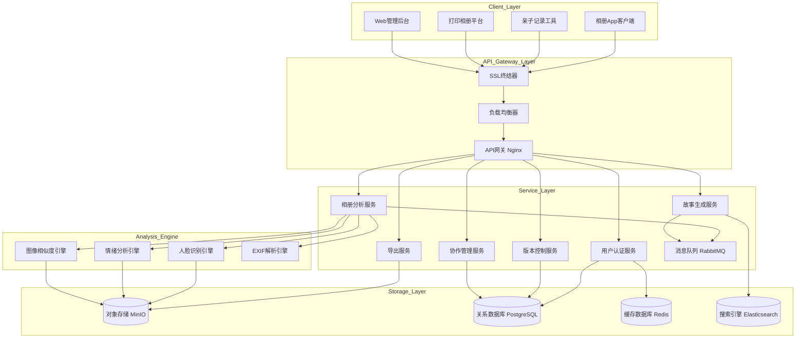
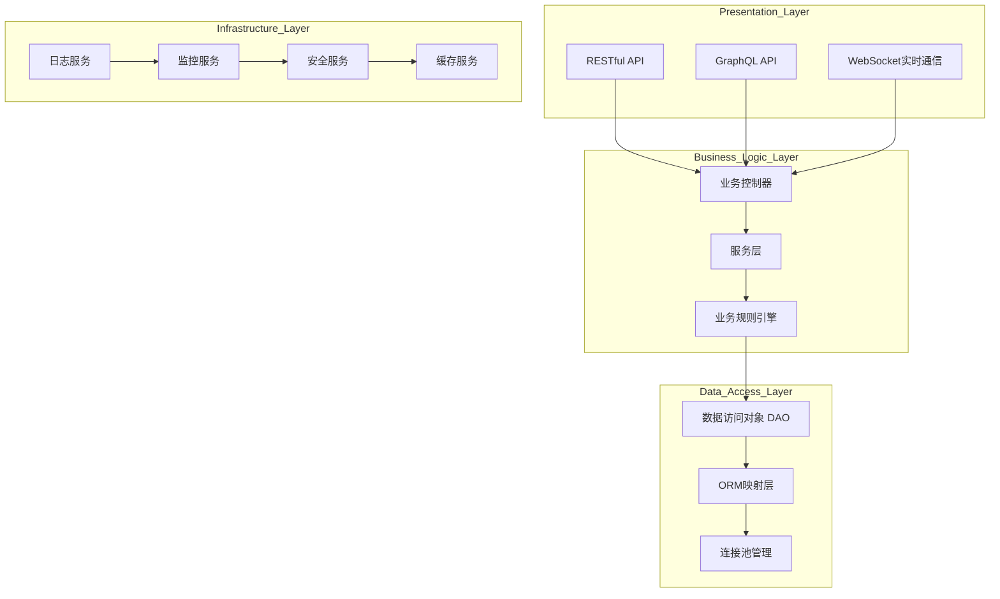
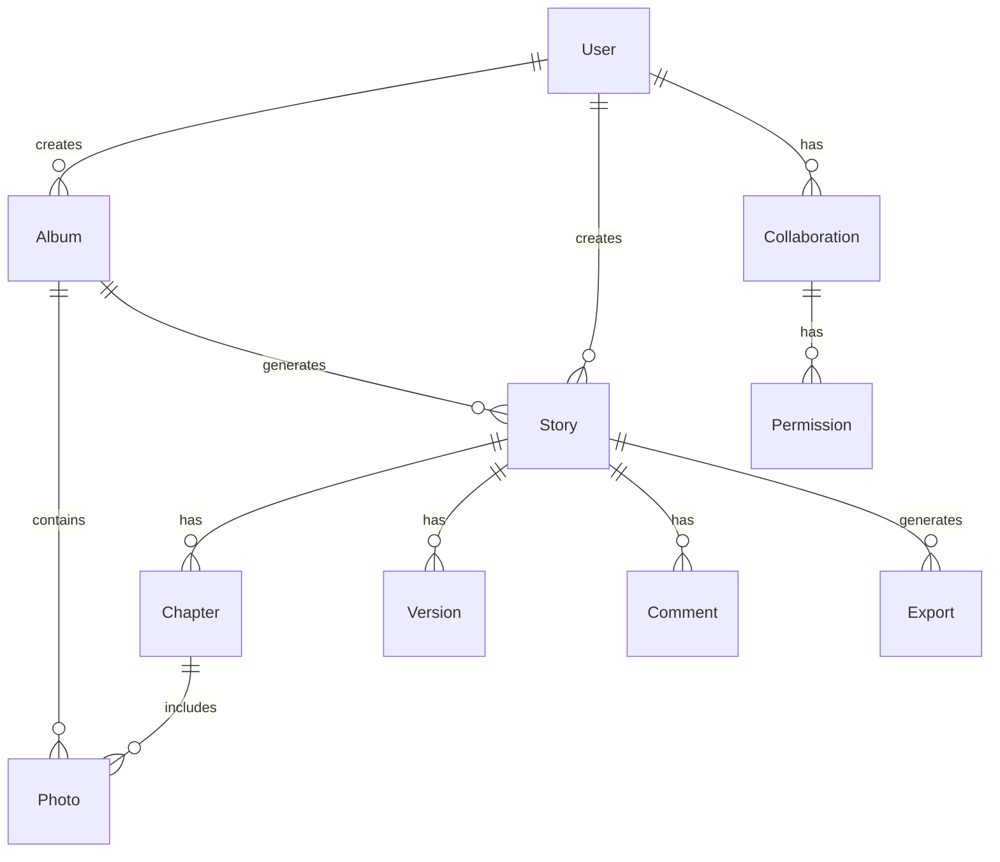
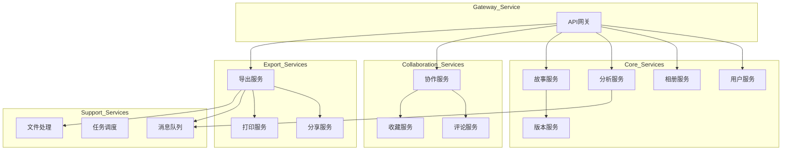
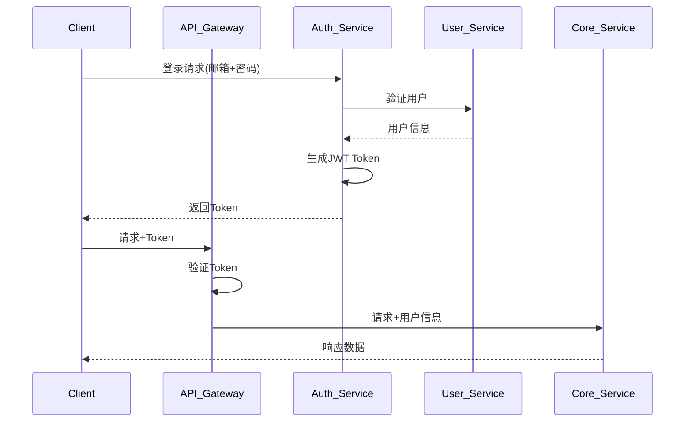
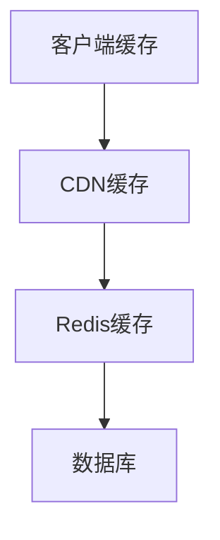
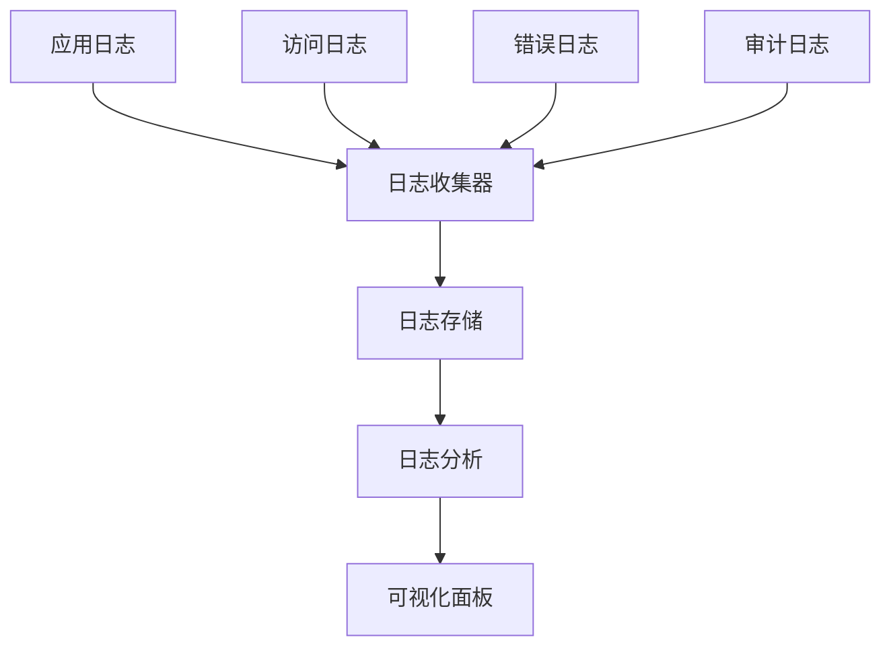

# 小相册故事化后端服务 - 技术架构文档

## 1. 系统架构设计

### 1.1 整体架构



### 1.2 服务分层架构



## 2. 技术栈选型

### 2.1 后端技术栈

**核心框架**：
- **Runtime**: Node.js 18 LTS 或 Python 3.11+
- **Framework**: Express.js 4.x 或 FastAPI 0.100+
- **Language**: TypeScript 5.x（推荐）或 Python
- **ORM**: Prisma 或 SQLAlchemy

**数据库**：
- **主数据库**: PostgreSQL 15
  - 存储业务数据、用户信息、故事版本
  - 使用JSONB存储灵活字段
  
- **缓存**: Redis 7
  - 会话管理
  - API响应缓存
  - 实时队列
  
- **对象存储**: MinIO 或 AWS S3
  - 照片原图存储
  - 生成的缩略图
  - 导出文件

**消息队列**：
- **RabbitMQ** 或 **Redis Queue**
- 异步任务处理
- 图片分析任务排队
- 导出任务排队

**搜索引擎**：
- **Elasticsearch** 8.x
- 全文搜索故事内容
- 标签和情绪检索

### 2.2 人工智能服务

**人脸识别**：
- Face Recognition (Python)
- TensorFlow FaceNet
- MTCNN人脸检测

**情绪分析**：
- Transformers库
- BERT-based情绪分类模型
- 自定义情绪标签体系

**图像处理**：
- OpenCV
- Pillow
- 图像相似度计算（感知哈希）

### 2.3 DevOps技术栈

**容器化**：
- Docker 24.x
- Docker Compose

**编排**：
- Kubernetes (可选，大规模部署)
- Docker Swarm (中等规模)

**CI/CD**：
- GitHub Actions
- Jenkins

**监控**：
- Prometheus
- Grafana
- ELK Stack

## 3. 数据库设计

### 3.1 ER关系图



### 3.2 表结构定义

#### 用户表 (users)

```sql
CREATE TABLE users (
    id UUID PRIMARY KEY DEFAULT gen_random_uuid(),
    email VARCHAR(255) UNIQUE NOT NULL,
    password_hash VARCHAR(255) NOT NULL,
    nickname VARCHAR(100),
    avatar_url VARCHAR(500),
    role VARCHAR(50) DEFAULT 'user',
    created_at TIMESTAMP DEFAULT CURRENT_TIMESTAMP,
    updated_at TIMESTAMP DEFAULT CURRENT_TIMESTAMP
);

CREATE INDEX idx_users_email ON users(email);
CREATE INDEX idx_users_created_at ON users(created_at);
```

#### 相册表 (albums)

```sql
CREATE TABLE albums (
    id UUID PRIMARY KEY DEFAULT gen_random_uuid(),
    user_id UUID NOT NULL REFERENCES users(id) ON DELETE CASCADE,
    name VARCHAR(255) NOT NULL,
    description TEXT,
    cover_photo_id UUID,
    photo_count INTEGER DEFAULT 0,
    status VARCHAR(50) DEFAULT 'active',
    created_at TIMESTAMP DEFAULT CURRENT_TIMESTAMP,
    updated_at TIMESTAMP DEFAULT CURRENT_TIMESTAMP
);

CREATE INDEX idx_albums_user_id ON albums(user_id);
CREATE INDEX idx_albums_created_at ON albums(created_at);
```

#### 照片表 (photos)

```sql
CREATE TABLE photos (
    id UUID PRIMARY KEY DEFAULT gen_random_uuid(),
    album_id UUID NOT NULL REFERENCES albums(id) ON DELETE CASCADE,
    url VARCHAR(500) NOT NULL,
    thumbnail_url VARCHAR(500),
    exif_data JSONB,
    analysis_result JSONB,
    face_data JSONB,
    emotion_tags TEXT[],
    location_data JSONB,
    taken_at TIMESTAMP,
    is_repeated BOOLEAN DEFAULT FALSE,
    is_flagged BOOLEAN DEFAULT FALSE,
    created_at TIMESTAMP DEFAULT CURRENT_TIMESTAMP
);

CREATE INDEX idx_photos_album_id ON photos(album_id);
CREATE INDEX idx_photos_taken_at ON photos(taken_at);
CREATE INDEX idx_photos_emotion_tags ON photos USING GIN(emotion_tags);
CREATE INDEX idx_photos_location ON photos USING GIN(location_data);
```

#### 故事表 (stories)

```sql
CREATE TABLE stories (
    id UUID PRIMARY KEY DEFAULT gen_random_uuid(),
    album_id UUID NOT NULL REFERENCES albums(id) ON DELETE CASCADE,
    user_id UUID NOT NULL REFERENCES users(id) ON DELETE CASCADE,
    title VARCHAR(255),
    style VARCHAR(50) NOT NULL,
    status VARCHAR(50) DEFAULT 'draft',
    settings JSONB,
    current_version INTEGER DEFAULT 1,
    created_at TIMESTAMP DEFAULT CURRENT_TIMESTAMP,
    updated_at TIMESTAMP DEFAULT CURRENT_TIMESTAMP
);

CREATE INDEX idx_stories_album_id ON stories(album_id);
CREATE INDEX idx_stories_user_id ON stories(user_id);
CREATE INDEX idx_stories_status ON stories(status);
```

#### 章节表 (chapters)

```sql
CREATE TABLE chapters (
    id UUID PRIMARY KEY DEFAULT gen_random_uuid(),
    story_id UUID NOT NULL REFERENCES stories(id) ON DELETE CASCADE,
    order_index INTEGER NOT NULL,
    title VARCHAR(255),
    description TEXT,
    cover_photo_id UUID,
    emotion_tags TEXT[],
    narration TEXT,
    postcard TEXT,
    created_at TIMESTAMP DEFAULT CURRENT_TIMESTAMP,
    updated_at TIMESTAMP DEFAULT CURRENT_TIMESTAMP
);

CREATE INDEX idx_chapters_story_id ON chapters(story_id);
CREATE INDEX idx_chapters_order ON chapters(story_id, order_index);
```

#### 章节照片关联表 (chapter_photos)

```sql
CREATE TABLE chapter_photos (
    id UUID PRIMARY KEY DEFAULT gen_random_uuid(),
    chapter_id UUID NOT NULL REFERENCES chapters(id) ON DELETE CASCADE,
    photo_id UUID NOT NULL REFERENCES photos(id) ON DELETE CASCADE,
    order_index INTEGER NOT NULL,
    caption TEXT,
    created_at TIMESTAMP DEFAULT CURRENT_TIMESTAMP
);

CREATE INDEX idx_chapter_photos_chapter_id ON chapter_photos(chapter_id);
CREATE INDEX idx_chapter_photos_photo_id ON chapter_photos(photo_id);
CREATE UNIQUE INDEX idx_chapter_photos_unique ON chapter_photos(chapter_id, order_index);
```

#### 版本表 (story_versions)

```sql
CREATE TABLE story_versions (
    id UUID PRIMARY KEY DEFAULT gen_random_uuid(),
    story_id UUID NOT NULL REFERENCES stories(id) ON DELETE CASCADE,
    version_number INTEGER NOT NULL,
    content JSONB NOT NULL,
    change_summary TEXT,
    created_by UUID NOT NULL REFERENCES users(id),
    created_at TIMESTAMP DEFAULT CURRENT_TIMESTAMP
);

CREATE INDEX idx_story_versions_story_id ON story_versions(story_id);
CREATE UNIQUE INDEX idx_story_versions_unique ON story_versions(story_id, version_number);
```

#### 协作者表 (collaborations)

```sql
CREATE TABLE collaborations (
    id UUID PRIMARY KEY DEFAULT gen_random_uuid(),
    story_id UUID NOT NULL REFERENCES stories(id) ON DELETE CASCADE,
    user_id UUID NOT NULL REFERENCES users(id) ON DELETE CASCADE,
    permission VARCHAR(50) NOT NULL,
    invited_by UUID REFERENCES users(id),
    invited_at TIMESTAMP DEFAULT CURRENT_TIMESTAMP,
    accepted_at TIMESTAMP,
    UNIQUE(story_id, user_id)
);

CREATE INDEX idx_collaborations_story_id ON collaborations(story_id);
CREATE INDEX idx_collaborations_user_id ON collaborations(user_id);
```

#### 评论表 (comments)

```sql
CREATE TABLE comments (
    id UUID PRIMARY KEY DEFAULT gen_random_uuid(),
    story_id UUID NOT NULL REFERENCES stories(id) ON DELETE CASCADE,
    user_id UUID NOT NULL REFERENCES users(id) ON DELETE CASCADE,
    chapter_id UUID REFERENCES chapters(id) ON DELETE CASCADE,
    content TEXT NOT NULL,
    position VARCHAR(50),
    created_at TIMESTAMP DEFAULT CURRENT_TIMESTAMP,
    updated_at TIMESTAMP DEFAULT CURRENT_TIMESTAMP
);

CREATE INDEX idx_comments_story_id ON comments(story_id);
CREATE INDEX idx_comments_user_id ON comments(user_id);
```

#### 收藏表 (favorites)

```sql
CREATE TABLE favorites (
    id UUID PRIMARY KEY DEFAULT gen_random_uuid(),
    user_id UUID NOT NULL REFERENCES users(id) ON DELETE CASCADE,
    story_id UUID NOT NULL REFERENCES stories(id) ON DELETE CASCADE,
    chapter_id UUID REFERENCES chapters(id) ON DELETE CASCADE,
    title VARCHAR(255),
    excerpt TEXT,
    created_at TIMESTAMP DEFAULT CURRENT_TIMESTAMP,
    UNIQUE(user_id, story_id, chapter_id)
);

CREATE INDEX idx_favorites_user_id ON favorites(user_id);
```

#### 导出记录表 (exports)

```sql
CREATE TABLE exports (
    id UUID PRIMARY KEY DEFAULT gen_random_uuid(),
    story_id UUID NOT NULL REFERENCES stories(id) ON DELETE CASCADE,
    user_id UUID NOT NULL REFERENCES users(id) ON DELETE CASCADE,
    export_type VARCHAR(50) NOT NULL,
    format VARCHAR(50) NOT NULL,
    file_url VARCHAR(500),
    settings JSONB,
    status VARCHAR(50) DEFAULT 'pending',
    created_at TIMESTAMP DEFAULT CURRENT_TIMESTAMP,
    completed_at TIMESTAMP
);

CREATE INDEX idx_exports_story_id ON exports(story_id);
CREATE INDEX idx_exports_user_id ON exports(user_id);
CREATE INDEX idx_exports_status ON exports(status);
```

## 4. API接口规范

### 4.1 API版本管理

所有API使用版本前缀：`/api/v1/`

### 4.2 统一响应格式

```typescript
interface ApiResponse<T> {
  success: boolean;
  data?: T;
  error?: {
    code: string;
    message: string;
    details?: any;
  };
  meta?: {
    page?: number;
    pageSize?: number;
    total?: number;
    timestamp: string;
    requestId: string;
  };
}
```

### 4.3 核心API端点

#### 相册管理

| 方法 | 端点 | 描述 |
|------|------|------|
| POST | /albums | 创建相册 |
| GET | /albums | 获取相册列表 |
| GET | /albums/:id | 获取相册详情 |
| PUT | /albums/:id | 更新相册信息 |
| DELETE | /albums/:id | 删除相册 |

#### 照片分析

| 方法 | 端点 | 描述 |
|------|------|------|
| POST | /albums/:id/photos | 添加照片到相册 |
| POST | /albums/:id/analyze | 触发相册分析 |
| GET | /albums/:id/analysis | 获取分析结果 |
| POST | /photos/batch | 批量上传照片 |

#### 故事生成

| 方法 | 端点 | 描述 |
|------|------|------|
| POST | /stories/generate | 生成故事 |
| GET | /stories/:id | 获取故事详情 |
| PUT | /stories/:id | 更新故事 |
| PUT | /stories/:id/chapters/:cid | 更新章节 |
| DELETE | /stories/:id | 删除故事 |

#### 版本控制

| 方法 | 端点 | 描述 |
|------|------|------|
| GET | /stories/:id/versions | 获取版本列表 |
| GET | /stories/:id/versions/:vid | 获取指定版本 |
| POST | /stories/:id/rollback | 回滚到指定版本 |
| GET | /stories/:id/diff | 版本对比 |

#### 协作管理

| 方法 | 端点 | 描述 |
|------|------|------|
| POST | /stories/:id/collaborators | 添加协作者 |
| GET | /stories/:id/collaborators | 获取协作者列表 |
| DELETE | /stories/:id/collaborators/:uid | 移除协作者 |
| PUT | /stories/:id/collaborators/:uid | 更新权限 |

#### 评论反馈

| 方法 | 端点 | 描述 |
|------|------|------|
| POST | /stories/:id/comments | 添加评论 |
| GET | /stories/:id/comments | 获取评论列表 |
| PUT | /comments/:id | 更新评论 |
| DELETE | /comments/:id | 删除评论 |

#### 收藏管理

| 方法 | 端点 | 描述 |
|------|------|------|
| POST | /favorites | 添加收藏 |
| GET | /favorites | 获取收藏列表 |
| DELETE | /favorites/:id | 删除收藏 |

#### 导出功能

| 方法 | 端点 | 描述 |
|------|------|------|
| POST | /stories/:id/export/share | 生成分享包 |
| POST | /stories/:id/export/print | 生成印刷版 |
| GET | /exports/:id | 获取导出状态 |
| GET | /exports/:id/download | 下载导出文件 |

### 4.4 请求/响应示例

#### 生成故事请求

```typescript
// POST /api/v1/stories/generate
// Request
{
  "albumId": "uuid-string",
  "style": "温馨" | "搞笑" | "旅行" | "成长" | "纪实" | "艺术",
  "settings": {
    "toneIntensity": 80, // 0-100
    "narrativeLength": "medium", // short | medium | long
    "emotionTendency": "positive" | "neutral" | "nostalgic",
    "emojiUsage": "low" | "medium" | "high",
    "poetry引用": true | false
  }
}

// Response
{
  "success": true,
  "data": {
    "storyId": "uuid-string",
    "title": "string",
    "style": "string",
    "chapters": [
      {
        "id": "uuid-string",
        "orderIndex": 1,
        "title": "string",
        "description": "string",
        "coverPhotoId": "uuid-string",
        "emotionTags": ["温馨", "感动"],
        "narration": "string",
        "postcard": "string",
        "photos": [
          {
            "id": "uuid-string",
            "url": "string",
            "caption": "string"
          }
        ]
      }
    ],
    "createdAt": "ISO8601 timestamp"
  }
}
```

#### 版本回滚请求

```typescript
// POST /api/v1/stories/:id/rollback
// Request
{
  "targetVersion": 3
}

// Response
{
  "success": true,
  "data": {
    "storyId": "uuid-string",
    "currentVersion": 3,
    "rolledBackAt": "ISO8601 timestamp"
  }
}
```

## 5. 服务架构设计

### 5.1 微服务划分



### 5.2 服务间通信

**同步通信**：REST API
- 服务间直接调用
- 超时时间：30秒
- 重试机制：3次

**异步通信**：RabbitMQ消息队列
- 事件驱动架构
- 消息持久化
- 死信队列处理

#### 消息队列主题

| 主题 | 生产者 | 消费者 | 描述 |
|------|--------|--------|------|
| photo.analyze | 相册服务 | 分析服务 | 照片分析任务 |
| analysis.completed | 分析服务 | 故事服务 | 分析完成通知 |
| story.generate | 故事服务 | 生成服务 | 故事生成任务 |
| export.request | 导出服务 | 文件处理 | 导出文件处理 |
| notification.send | 协作服务 | 通知服务 | 发送通知 |

## 6. 安全架构

### 6.1 认证授权

**JWT认证流程**：



**权限控制矩阵**：

| 角色 | 浏览 | 编辑 | 协作者管理 | 删除 | 导出 |
|------|------|------|-----------|------|------|
| 访客 | ✓ | ✗ | ✗ | ✗ | ✗ |
| 协作者(查看) | ✓ | ✗ | ✗ | ✗ | ✗ |
| 协作者(编辑) | ✓ | ✓ | ✗ | ✗ | ✗ |
| 所有者 | ✓ | ✓ | ✓ | ✓ | ✓ |
| 管理员 | ✓ | ✓ | ✓ | ✓ | ✓ |

### 6.2 数据安全

**敏感数据处理**：
- 密码：bcrypt哈希（cost factor: 12）
- 人脸数据：加密存储（AES-256）
- 位置信息：可选脱敏
- 隐私照片：端到端加密

**传输安全**：
- HTTPS强制
- TLS 1.3
- 证书自动更新

## 7. 性能优化

### 7.1 缓存策略

**多级缓存架构**：



**缓存规则**：

| 数据类型 | 缓存策略 | TTL | 更新机制 |
|---------|---------|-----|---------|
| 用户会话 | Redis | 24h | 主动失效 |
| 分析结果 | Redis | 7天 | 照片更新失效 |
| 故事列表 | Redis | 1h | 主动失效 |
| 版本历史 | 数据库 | - | 版本创建时更新 |
| 热门故事 | Redis | 30分钟 | LRU淘汰 |

### 7.2 异步处理

**长时间任务队列**：
- 照片分析：预估30秒-2分钟
- 故事生成：预估5-10秒
- 导出生成：预估10-30秒

**WebSocket实时推送**：
- 任务进度更新
- 新评论通知
- 协作者在线状态

### 7.3 性能指标

| 指标 | 目标值 | 告警阈值 |
|------|--------|---------|
| API响应时间(P95) | < 200ms | > 500ms |
| 照片分析时间(100张) | < 30s | > 60s |
| 故事生成时间 | < 5s | > 15s |
| 系统可用性 | 99.9% | < 99.5% |
| 错误率 | < 0.1% | > 1% |

## 8. 部署架构

### 8.1 Docker Compose 部署

```yaml
version: '3.8'

services:
  api-gateway:
    build: ./api-gateway
    ports:
      - "80:80"
    depends_on:
      - user-service
      - album-service
      - story-service
    networks:
      - backend

  user-service:
    build: ./services/user-service
    environment:
      - DATABASE_URL=postgresql://postgres:password@db:5432/storydb
      - REDIS_URL=redis://cache:6379
    depends_on:
      - db
      - cache
    networks:
      - backend

  album-service:
    build: ./services/album-service
    depends_on:
      - db
      - cache
      - minio
    networks:
      - backend

  story-service:
    build: ./services/story-service
    depends_on:
      - db
      - cache
      - rabbitmq
    networks:
      - backend

  analysis-service:
    build: ./services/analysis-service
    volumes:
      - ./models:/app/models
    depends_on:
      - rabbitmq
      - minio
    networks:
      - backend

  db:
    image: postgres:15
    environment:
      - POSTGRES_PASSWORD=password
      - POSTGRES_DB=storydb
    volumes:
      - pgdata:/var/lib/postgresql/data
    networks:
      - backend

  cache:
    image: redis:7
    networks:
      - backend

  rabbitmq:
    image: rabbitmq:3-management
    ports:
      - "15672:15672"
    networks:
      - backend

  minio:
    image: minio/minio
    environment:
      - MINIO_ROOT_PASSWORD=minioadmin
      - MINIO_ROOT_USER=minioadmin
    volumes:
      - miniodata:/data
    networks:
      - backend

networks:
  backend:
    driver: bridge

volumes:
  pgdata:
  miniodata:
```

### 8.2 环境配置

**开发环境**：
- 单机Docker Compose
- 本地数据库
- 开发API密钥

**生产环境**：
- Kubernetes集群
- 云数据库服务
- 高可用架构
- 自动扩缩容

## 9. 监控与日志

### 9.1 日志架构



### 9.2 关键监控指标

**基础设施指标**：
- CPU使用率
- 内存使用率
- 磁盘I/O
- 网络流量

**应用指标**：
- 请求速率
- 响应时间分布
- 错误率
- 队列深度

**业务指标**：
- 活跃用户数
- 故事生成量
- 照片分析量
- 导出成功率

## 10. 项目结构

```
story-service/
├── api-gateway/                 # API网关服务
├── services/                    # 微服务目录
│   ├── user-service/           # 用户服务
│   ├── album-service/          # 相册服务
│   ├── analysis-service/       # 分析服务
│   ├── story-service/          # 故事服务
│   ├── collaboration-service/   # 协作服务
│   └── export-service/         # 导出服务
├── shared/                     # 共享模块
│   ├── common/                 # 通用工具
│   ├── models/                 # 数据模型
│   ├── middleware/            # 中间件
│   └── config/                # 配置管理
├── scripts/                    # 脚本文件
│   ├── init-db.sql            # 数据库初始化
│   └── seed-data.sql          # 种子数据
├── tests/                      # 测试目录
├── docker-compose.yml         # Docker编排
├── Dockerfile                 # Docker镜像
└── package.json              # 依赖管理
```

## 11. 开发规范

### 11.1 代码规范

- **命名规范**：遵循各语言官方风格指南
- **注释规范**：JSDoc/TSDoc文档注释
- **提交规范**：Conventional Commits
- **代码审查**：PR必须经过至少1人审查

### 11.2 测试规范

- **单元测试**：覆盖率 > 80%
- **集成测试**：核心流程覆盖
- **端到端测试**：关键用户路径
- **性能测试**：负载测试和压力测试

### 11.3 文档规范

- **API文档**：OpenAPI 3.0规范
- **架构文档**：实时更新
- **部署文档**：运维手册
- **用户文档**：使用指南

## 12. 附录

### 12.1 技术选型理由

**Node.js vs Python**：
- 选择Node.js：JSON处理高效，适合I/O密集型
- 选择Python：AI模型集成更方便，适合计算密集型

**PostgreSQL vs MySQL**：
- PostgreSQL的JSONB支持更灵活
- 更强大的全文搜索能力
- 更好的事务支持

**RabbitMQ vs Kafka**：
- RabbitMQ：延迟更低，适合小消息
- 更简单的运维
- 支持优先级队列

### 12.2 扩展计划

**短期**：
- MVP版本发布
- 基础分析功能
- 6种叙事风格
- 基础导出功能

**中期**：
- 多人实时协作
- 更多AI模型集成
- 移动端SDK
- 国际化支持

**长期**：
- AI故事续写
- 智能配乐
- 视频故事生成
- 社交分享集成
